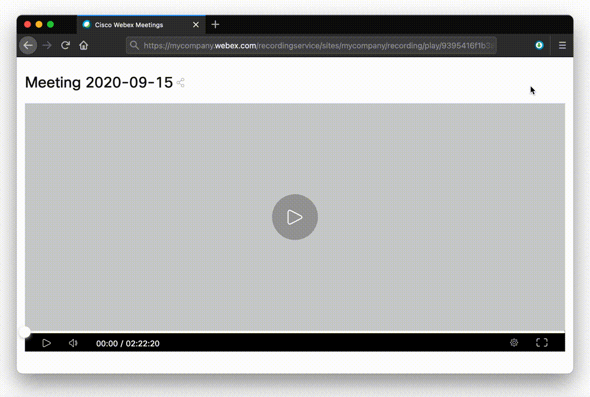

# WebXDownloader

This is a browser extension that helps downloading Webex meeting recordings. It provides the direct URL to the HSL stream and the `ffmpeg` command needed in order to download the stream and convert it into an mp4 video file.

## Installation

### Firefox (recommended)

Download the `.xpi` file from the [latest release](https://github.com/jacopo-j/WebXDownloader/releases) and drag it to any Firefox window to install.

### Google Chrome

* Download the `.zip` file from the [latest release](https://github.com/jacopo-j/WebXDownloader/releases)
* Extract the zip file
* Browse to `chrome://extensions`
* Turn on "Developer mode" on the top right
* Click "Load unpacked extension..." on the top left
* Select the folder to which your zip file was extracted.

## Usage

Just browse to the meeting recording page and launch the extension.

In order to convert the video stream into an mp4 file, select "Full ffmpeg command" and copy-paste the output into your terminal. Of course you'll need to have [ffmpeg](https://ffmpeg.org) installed.

> :warning: **Friendly reminder**: always mind what you paste into your terminal. While some basic escaping was put in place, you should double check that everything looks fine before running.
